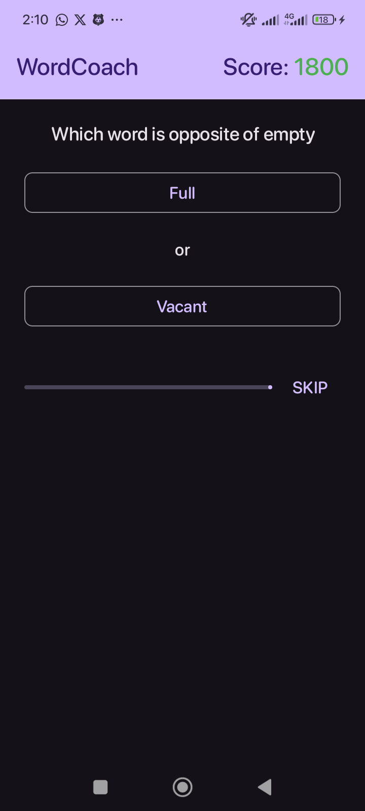
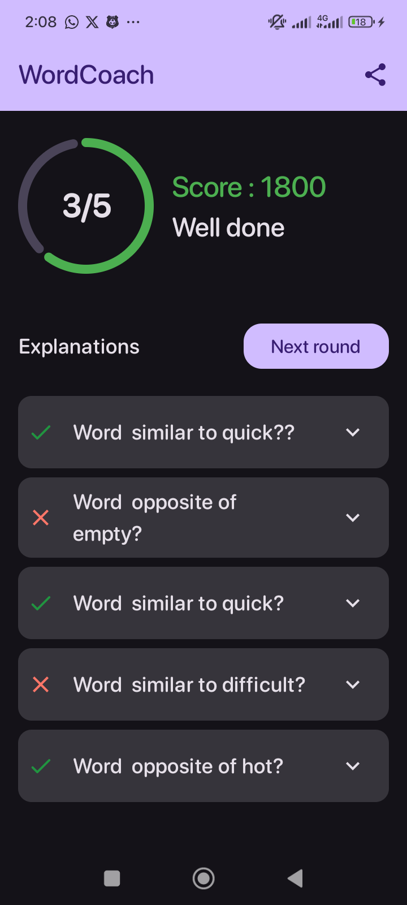

# Word Coach


## Description
Word Coach is a Kotlin-based Android clone of Google's popular Word Coach game. It is a vocabulary game where users identify synonyms and antonyms of words. The app tracks the user's score cumulatively across multiple sessions, providing a fun and educational experience.

## Features
- **Vocabulary Game**: Identify synonyms and antonyms of words.
- **Score Tracking**: Tracks user scores across multiple sessions.
- **Multiple Screens**: Includes splash screen, game screen, and result screen.
- **Smooth Animations**: Enjoy a smooth splash screen animation.
- **Clean Architecture**: Follows modern Android development best practices.

## Built With
- [Kotlin](https://kotlinlang.org/)
- [Jetpack Compose](https://developer.android.com/jetpack/compose) - Modern UI toolkit
- [Hilt](https://dagger.dev/hilt/) - Dependency injection
- [DataStore](https://developer.android.com/topic/libraries/architecture/datastore) - Persistent storage
- [StateFlow](https://developer.android.com/kotlin/flow/stateflow-and-sharedflow) - State management
- [Coroutines](https://kotlinlang.org/docs/coroutines-overview.html) - Asynchronous operations

## Screenshots

### Splash Screen


### Game Screen


### Result Screen


## Getting Started
### Prerequisites
- Android Studio 4.2 or higher
- JDK 8 or higher

### Installation
1. Clone the repository:
   ```bash
   git clone https://github.com/Abaho1914/WordCoach.git

## How to Play
1. Launch the app.
2. You will be taken to the game screen after the splash screen.
3. Identify the correct synonyms or antonyms for the given word.
4. Your score will be tracked and displayed on the results screen.

## Future Enhancements
- Add new word categories and levels.
- Implement multiplayer mode.
- Add daily challenges and rewards.

## Contributing
Contributions make the open-source community such an amazing place to learn, inspire, and create. Any contributions you make are greatly appreciated.

Fork the Project
1. Create your Feature Branch (git checkout -b feature/AmazingFeature)
2. Commit your changes (git commit -m 'Add some AmazingFeature')
3. Push to the Branch (git push origin feature/AmazingFeature)
4. Open a Pull Request

## License
Distributed under the MIT License. See LICENSE for more information.

## Contact
Your Name - @abahoabbott - abahoabbott@gmail.com

Project Link: https://github.com/Abaho1914/WordCoach

## Acknowledgments
- [Google Word Coach](https://www.google.com/search?stick=H4sIAAAAAAAAAOMweMSoyi3w8sc9YSmZSWtOXmMU4-ILy09OTCrNSSyqdE_MTbViUWJKzeNZxCronp-fnpOqEJ5flKLgnJ-YnAEA0wVihT4AAAA&q=Google+Word+Coach&shndl=14&source=sh/x/lr/vocabulary/m1/4&kgs=c764bb3a9b0cbb28)
- [Kotlin](https://kotlinlang.org/)
- [Jetpack Compose](https://developer.android.com/jetpack/compose) 
- [Hilt](https://dagger.dev/hilt/)
- [DataStore](https://developer.android.com/topic/libraries/architecture/datastore)
- [StateFlow](https://developer.android.com/kotlin/flow/stateflow-and-sharedflow)
- [Coroutines](https://kotlinlang.org/docs/coroutines-overview.html)
